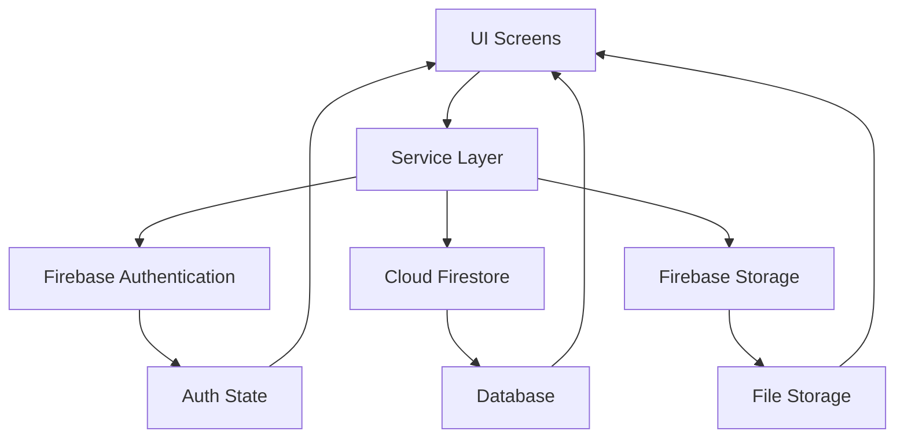
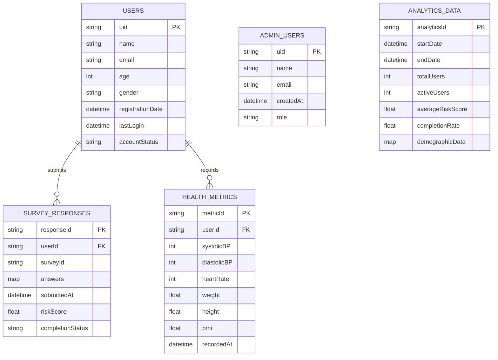
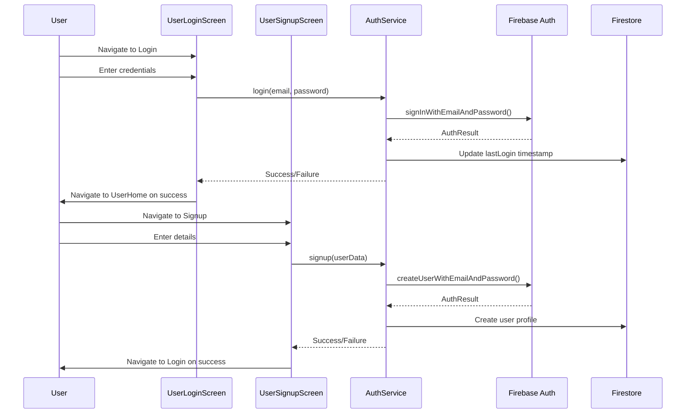
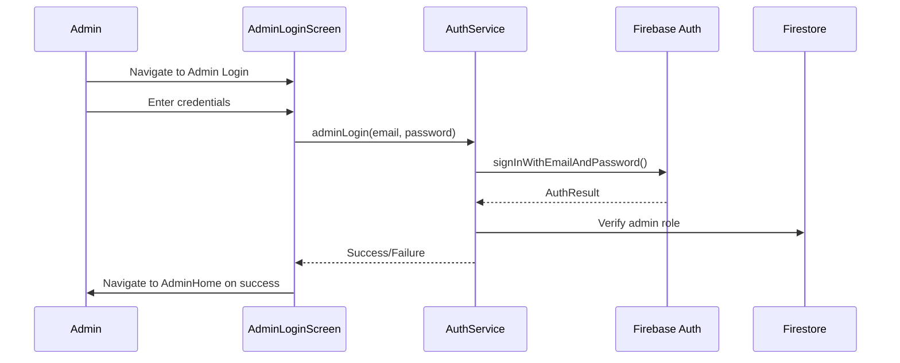

# Firebase Integration Design Document

## 1. Overview

This document outlines the design for implementing Firebase functionalities across all screens of the survey application. The integration will replace all hardcoded data with dynamic data fetched from Firebase services including Authentication, Cloud Firestore, and potentially Firebase Storage. The implementation will cover user authentication flows (login/signup), admin authentication, and data management for all application features.

## 2. Architecture

The Firebase integration follows a layered architecture approach:

```
┌─────────────────────────────────────────────────────────────┐
│                    Presentation Layer                       │
│  (UI Screens: User Login, Signup, Admin, Surveys, etc.)    │
├─────────────────────────────────────────────────────────────┤
│                    Service Layer                            │
│  (Authentication Service, User Service, Survey Service,    │
│   Analytics Service, Admin Service)                        │
├─────────────────────────────────────────────────────────────┤
│                    Data Access Layer                        │
│  (Firebase Authentication, Cloud Firestore, Firebase       │
│   Storage)                                                 │
└─────────────────────────────────────────────────────────────┘
```

### 2.1 Key Components

1. **Authentication Service**: Handles user/admin authentication using Firebase Authentication
2. **User Service**: Manages user profile data in Firestore
3. **Survey Service**: Handles survey creation, submission, and retrieval
4. **Analytics Service**: Manages analytics data for admin dashboard
5. **Health Metrics Service**: Handles health metrics data storage and retrieval
6. **Admin Service**: Manages admin-specific functionalities

### 2.2 Data Flow



## 3. Firebase Services Implementation

### 3.1 Firebase Authentication

#### 3.1.1 User Authentication
- Email/Password authentication for regular users
- Session management with auth state listeners
- Password reset functionality
- Email verification workflow

#### 3.1.2 Admin Authentication
- Separate authentication flow for admin users
- Role-based access control
- Admin-only session validation

### 3.2 Cloud Firestore Structure

#### 3.2.1 Database Collections



### 3.3 Firebase Storage
- Storage of any media files (if required in future)
- Secure access with download URLs

## 4. Authentication Flow Implementation

### 4.1 User Authentication Flow



### 4.2 Admin Authentication Flow



## 5. Screen-by-Screen Implementation

### 5.1 User Screens

#### 5.1.1 User Login Screen (`user_login_screen.dart`)
- Replace hardcoded navigation with Firebase authentication
- Implement `login()` method to use FirebaseAuth
- Add loading state during authentication
- Handle authentication errors appropriately
- Navigate to UserHome on successful authentication

#### 5.1.2 User Signup Screen (`user_signup_screen.dart`)
- Replace hardcoded navigation with Firebase user creation
- Implement `signup()` method to use FirebaseAuth
- Store additional user data in Firestore collection 'users'
- Add loading state during account creation
- Handle creation errors appropriately
- Navigate to Login screen on successful creation

#### 5.1.3 User Home Screen (`user_home_screen.dart`)
- Implement user data retrieval from Firestore
- Add logout functionality with Firebase signOut
- Implement auth state listener to handle session changes

#### 5.1.4 Survey Screen (`survey_screen.dart`)
- Fetch survey questions from Firestore
- Submit survey responses to Firestore collection 'survey_responses'
- Calculate risk scores based on responses
- Store completion status

#### 5.1.5 Monitoring Screen (`monitoring_screen.dart`)
- Fetch health metrics from Firestore
- Submit new health metrics to Firestore collection 'health_metrics'
- Display historical data in charts/graphs

#### 5.1.6 Analysis Screen (`analysis_screen.dart`)
- Fetch user-specific analytics from Firestore
- Display personalized risk assessments
- Show historical survey data

### 5.2 Admin Screens

#### 5.2.1 Admin Login Screen (`admin_login_screen.dart`)
- Implement admin-specific authentication
- Verify admin role from Firestore collection 'admin_users'
- Add loading state during authentication
- Handle authentication errors appropriately
- Navigate to AdminHome on successful authentication

#### 5.2.2 Admin Home Screen (`admin_home_screen.dart`)
- Implement admin data retrieval from Firestore
- Add logout functionality with Firebase signOut
- Implement auth state listener to handle session changes

#### 5.2.3 Account Management Screen (`account_management_screen.dart`)
- Fetch user accounts from Firestore collection 'users'
- Implement account status management (activate/deactivate)
- Enable admin to view user details

#### 5.2.4 Analytics Screen (`analytics_screen.dart`)
- Fetch analytics data from Firestore collection 'analytics_data'
- Display system-wide metrics and statistics
- Show demographic data visualizations

#### 5.2.5 Answers Management Screen (`answers_management_screen.dart`)
- Fetch survey responses from Firestore collection 'survey_responses'
- Enable filtering by user, date, completion status
- Display detailed response information

## 6. Service Layer Implementation

### 6.1 Authentication Service
```dart
class AuthService {
  final FirebaseAuth _auth = FirebaseAuth.instance;
  final FirebaseFirestore _firestore = FirebaseFirestore.instance;
  
  // User authentication methods
  Future<UserCredential> login(String email, String password) { }
  Future<UserCredential> signup(Map<String, dynamic> userData) { }
  Future<void> logout() { }
  Stream<User?> get authStateChanges => _auth.authStateChanges();
  
  // Admin authentication methods
  Future<UserCredential> adminLogin(String email, String password) { }
  Future<bool> isAdmin(String uid) { }
}
```

### 6.2 User Service
```dart
class UserService {
  final FirebaseFirestore _firestore = FirebaseFirestore.instance;
  
  Future<void> createUserProfile(String uid, Map<String, dynamic> userData) { }
  Future<UserProfile> getUserProfile(String uid) { }
  Future<void> updateUserProfile(String uid, Map<String, dynamic> userData) { }
  Stream<List<UserProfile>> getAllUsers() { }
}
```

### 6.3 Survey Service
```dart
class SurveyService {
  final FirebaseFirestore _firestore = FirebaseFirestore.instance;
  
  Future<void> submitSurveyResponse(Map<String, dynamic> response) { }
  Stream<List<SurveyResponse>> getUserResponses(String userId) { }
  Stream<List<SurveyResponse>> getAllResponses() { }
}
```

### 6.4 Health Metrics Service
```dart
class HealthMetricsService {
  final FirebaseFirestore _firestore = FirebaseFirestore.instance;
  
  Future<void> recordHealthMetrics(Map<String, dynamic> metrics) { }
  Stream<List<HealthMetrics>> getUserMetrics(String userId) { }
}
```

### 6.5 Analytics Service
```dart
class AnalyticsService {
  final FirebaseFirestore _firestore = FirebaseFirestore.instance;
  
  Stream<AnalyticsData> getAnalyticsData() { }
  Future<void> updateAnalyticsData(Map<String, dynamic> data) { }
}
```

## 7. Security Rules

### 7.1 Firestore Security Rules
```
rules_version = '2';
service cloud.firestore {
  match /databases/{database}/documents {
    // Users can read/write their own profile
    match /users/{userId} {
      allow read, write: if request.auth != null && request.auth.uid == userId;
    }
    
    // Users can read/write their own survey responses
    match /survey_responses/{responseId} {
      allow read, write: if request.auth != null && 
        resource.data.userId == request.auth.uid;
    }
    
    // Users can read/write their own health metrics
    match /health_metrics/{metricId} {
      allow read, write: if request.auth != null && 
        resource.data.userId == request.auth.uid;
    }
    
    // Admins can read all user data
    match /users/{userId} {
      allow read: if request.auth != null && isAdmin(request.auth.uid);
    }
    
    // Admins can read all survey responses
    match /survey_responses/{responseId} {
      allow read: if request.auth != null && isAdmin(request.auth.uid);
    }
    
    // Admins can read all health metrics
    match /health_metrics/{metricId} {
      allow read: if request.auth != null && isAdmin(request.auth.uid);
    }
    
    // Admins can read/write analytics data
    match /analytics_data/{analyticsId} {
      allow read, write: if request.auth != null && isAdmin(request.auth.uid);
    }
    
    // Admin users collection
    match /admin_users/{adminId} {
      allow read: if request.auth != null && 
        request.auth.uid == adminId || isAdmin(request.auth.uid);
    }
  }
  
  function isAdmin(uid) {
    return get(/databases/$(database)/documents/admin_users/$(uid)).data.role == 'admin';
  }
}
```

## 8. Error Handling

### 8.1 Authentication Errors
- Invalid email format
- Weak password
- Email already in use
- User not found
- Wrong password
- Network errors

### 8.2 Firestore Errors
- Permission denied
- Document not found
- Network errors
- Quota exceeded

### 8.3 General Error Handling Strategy
- Display user-friendly error messages
- Log errors for debugging
- Implement retry mechanisms where appropriate
- Gracefully handle offline scenarios

## 9. Testing

### 9.1 Unit Tests
- Authentication service methods
- Data model serialization/deserialization
- Service layer methods

### 9.2 Integration Tests
- Authentication flows
- Data persistence and retrieval
- Admin/user role validation

### 9.3 Widget Tests
- UI component rendering with Firebase data
- Error state handling in UI
- Loading state management

## 10. Migration Plan

### 10.1 Phase 1: Authentication
1. Implement AuthService with Firebase Authentication
2. Replace hardcoded navigation in login/signup screens
3. Add auth state listeners

### 10.2 Phase 2: User Data
1. Implement UserService
2. Replace hardcoded user data with Firestore data
3. Implement user profile management

### 10.3 Phase 3: Survey Functionality
1. Implement SurveyService
2. Connect survey screens to Firestore
3. Implement response submission and retrieval

### 10.4 Phase 4: Admin Functionality
1. Implement admin authentication
2. Create admin services
3. Connect admin screens to Firestore

### 10.5 Phase 5: Analytics & Monitoring
1. Implement AnalyticsService
2. Connect analytics screens to Firestore
3. Implement health metrics functionality