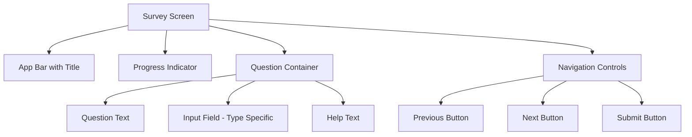
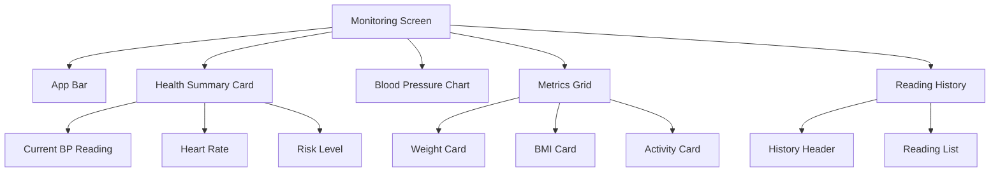
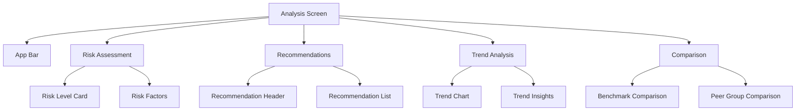
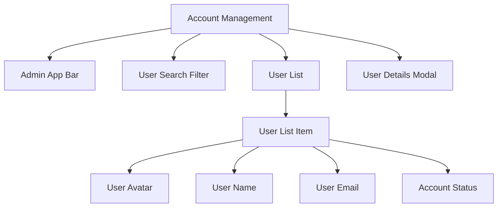
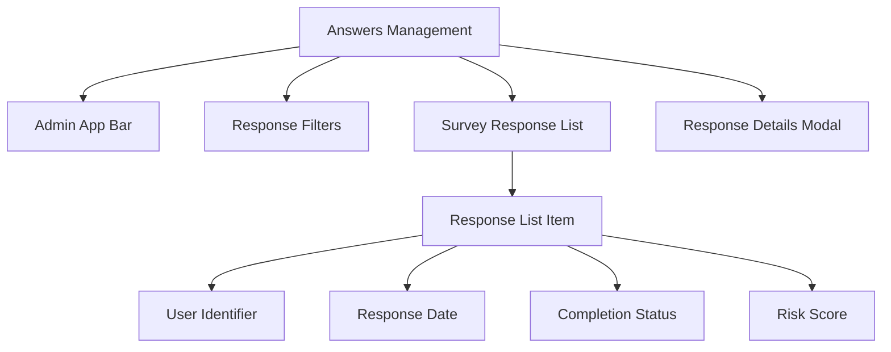
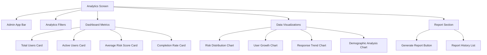

# Survey-Based Hypertension Monitoring App Design

## Overview

This document outlines the design for a Flutter-based mobile application that helps users detect and monitor hypertension through surveys and provides analytics for administrators. The app consists of two main interfaces: User Side and Admin Side.

## User Roles and Permissions

### Regular User
- Can complete hypertension risk surveys
- Can view personal health metrics and trends
- Can monitor blood pressure readings over time
- Can view personalized health recommendations
- Cannot access other users' data

### Administrator
- Can manage user accounts (create, update, disable)
- Can view all survey responses
- Can generate analytics and reports
- Can export data
- Has full access to system analytics

## Technology Stack & Dependencies

- **Framework**: Flutter (Dart)
- **State Management**: Provider or Riverpod (recommended)
- **Navigation**: Flutter Navigator 2.0
- **UI Components**: Material Design
- **Local Storage**: Shared Preferences or SQLite
- **Networking**: http or dio package (if needed)
- **Charts**: fl_chart or syncfusion_flutter_charts
- **App Icon**: assets/images/logo.png

## User Side Features

### 1. Survey Feature

#### Survey Question Types
Based on the hypertension risk assessment requirements, the survey will include the following question types:

- **Numeric Input**: For age, height, weight, etc.
- **Single Choice**: For categorical questions like gender, smoking habits, etc.
- **Multiple Choice**: For questions where multiple answers are possible
- **Boolean (Yes/No)**: For family history, current medication, etc.
- **Scale Rating**: For subjective assessments like stress levels, activity levels
- **Date Picker**: For medical history dates

#### Component Definition
- SurveyQuestionCard: Displays individual survey questions with appropriate input fields
- SurveyProgressIndicator: Shows completion progress of the survey
- SurveyNavigation: Handles next/previous question navigation
- SurveySubmitButton: Handles survey submission

#### Component Hierarchy
```
SurveyScreen
├── SurveyAppBar
├── SurveyProgressIndicator
├── SurveyQuestionContainer
│   ├── SurveyQuestionCard
│   │   ├── QuestionText
│   │   ├── AnswerInput (various types based on question)
│   │   └── QuestionHelpText
│   └── NavigationControls
│       ├── PreviousButton
│       ├── NextButton
│       └── SubmitButton
└── SurveyFooter
```

#### Props/State Management
- Current question index
- User answers map
- Survey completion status
- Validation states for required questions

#### Example Usage
```
SurveyScreen(
  surveyId: "hypertension_risk_2023",
  questions: [
    {
      id: "age",
      type: "number",
      text: "What is your age?",
      required: true
    },
    {
      id: "family_history",
      type: "boolean",
      text: "Do you have a family history of hypertension?",
      required: true
    }
  ]
)
```

#### UI Wireframe


### 2. Monitoring Feature

#### Component Definition
- BloodPressureChart: Visualizes blood pressure readings over time
- HealthMetricsCard: Displays key health metrics
- ReadingHistoryList: Shows historical readings
- AddReadingButton: Allows users to add new readings

#### Component Hierarchy
```
MonitoringScreen
├── MonitoringAppBar
├── HealthSummaryCard
│   ├── CurrentBloodPressure
│   ├── HeartRateDisplay
│   └── RiskLevelIndicator
├── BloodPressureChart
├── MetricsGrid
│   ├── WeightCard
│   ├── BMI_Card
│   └── ActivityCard
└── ReadingHistorySection
    ├── HistoryHeader
    └── ReadingHistoryList
```

#### Props/State Management
- Current blood pressure readings
- Historical data points
- User health metrics
- Date range filters

#### UI Wireframe


### 3. Analysis Feature

#### Health Risk Levels
The app will categorize hypertension risk into the following levels based on survey responses and health metrics:

- **Normal (0-20)**: Low risk, healthy blood pressure range
- **Elevated (21-40)**: Slightly elevated risk, pre-hypertension
- **High (41-60)**: Moderate risk, stage 1 hypertension
- **Very High (61-80)**: High risk, stage 2 hypertension
- **Critical (81-100)**: Very high risk, requires immediate medical attention

#### Component Definition
- RiskAssessmentCard: Displays hypertension risk level
- RecommendationList: Shows personalized health recommendations
- TrendAnalysisChart: Shows health trends over time
- ComparisonWidget: Compares user data with benchmarks

#### Component Hierarchy
```
AnalysisScreen
├── AnalysisAppBar
├── RiskAssessmentSection
│   ├── RiskLevelCard
│   └── RiskFactorsList
├── RecommendationsSection
│   ├── RecommendationHeader
│   └── RecommendationList
├── TrendAnalysisSection
│   ├── TrendChart
│   └── TrendInsights
└── ComparisonSection
    ├── BenchmarkComparison
    └── PeerGroupComparison
```

#### Props/State Management
- Risk assessment results
- Personalized recommendations
- Trend data
- Comparison benchmarks

#### UI Wireframe


## Admin Side Features

### 1. Account Management

#### Component Definition
- UserList: Displays all registered users
- UserDetails: Shows detailed information about a specific user
- AccountActions: Provides actions like enable/disable accounts
- SearchFilter: Allows filtering users by various criteria

#### Component Hierarchy
```
AccountManagementScreen
├── AdminAppBar
├── UserSearchFilter
├── UserList
│   ├── UserListItem
│   │   ├── UserAvatar
│   │   ├── UserName
│   │   ├── UserEmail
│   │   └── AccountStatus
│   └── UserListPagination
└── UserDetailsModal
```

#### Props/State Management
- List of users
- Filter criteria
- Selected user details
- Account status states

#### UI Wireframe


### 2. Answers Management

#### Component Definition
- SurveyResponseList: Shows all survey responses
- ResponseDetails: Displays detailed answers for a specific response
- ResponseFilters: Allows filtering by date, user, etc.
- ExportButton: Enables exporting data

#### Component Hierarchy
```
AnswersManagementScreen
├── AdminAppBar
├── ResponseFilters
├── SurveyResponseList
│   ├── ResponseListItem
│   │   ├── UserIdentifier
│   │   ├── ResponseDate
│   │   ├── CompletionStatus
│   │   └── RiskScore
│   └── ResponseListPagination
└── ResponseDetailsModal
```

#### Props/State Management
- Survey responses collection
- Filter parameters
- Selected response details
- Export options

#### UI Wireframe


### 3. Graph and Analytics Feature

#### Data Visualization Types

The analytics feature will include the following visualization types:

- **Bar Charts**: For comparing user demographics and risk distributions
- **Line Charts**: For showing trends over time (user growth, response rates)
- **Pie Charts**: For displaying proportions (gender distribution, risk level distribution)
- **Heat Maps**: For identifying patterns in user responses
- **Histograms**: For showing frequency distributions of health metrics
- **Scatter Plots**: For correlation analysis between different health factors

#### Component Definition
- AnalyticsDashboard: Main dashboard showing key metrics
- DataVisualization: Charts showing various analytics
- ReportGenerator: Creates reports based on data
- FilterControls: Controls for filtering analytics data

#### Component Hierarchy
```
AnalyticsScreen
├── AdminAppBar
├── AnalyticsFilters
├── DashboardMetrics
│   ├── TotalUsersCard
│   ├── ActiveUsersCard
│   ├── AverageRiskScoreCard
│   └── CompletionRateCard
├── DataVisualizations
│   ├── RiskDistributionChart
│   ├── UserGrowthChart
│   ├── ResponseTrendChart
│   └── DemographicAnalysisChart
└── ReportSection
    ├── GenerateReportButton
    └── ReportHistoryList
```

#### Props/State Management
- Analytics data
- Filter parameters
- Chart configurations
- Report generation status

#### UI Wireframe


## Routing & Navigation

### User Side Navigation
```
- / (SplashScreen) -> /home
- /home (Bottom Navigation)
  - /survey (Survey Feature)
  - /monitoring (Monitoring Feature)
  - /analysis (Analysis Feature)
```

### Admin Side Navigation
```
- /admin (Admin Login)
- /admin/dashboard (Admin Dashboard)
  - /admin/accounts (Account Management)
  - /admin/answers (Answers Management)
  - /admin/analytics (Graph and Analytics)
```

## UI Components

Based on the existing widget library in the project, we can leverage the following components:

- **AppTextFieldFormField**: For text input fields in surveys
- **ButtonWidget**: For navigation controls and action buttons
- **DatePickerWidget**: For date selection in health metrics
- **TextWidget**: For consistent text styling throughout the app
- **ToastWidget**: For user notifications and feedback

Custom components to be developed:
- **SurveyQuestionCard**: Extending existing card components with specialized layouts
- **HealthMetricsCard**: For displaying health data with appropriate visual indicators
- **Charting Components**: Using fl_chart or syncfusion_flutter_charts for data visualization

### App Icon Usage

The app icon located at `assets/images/logo.png` will be used in the following places:
- Application launcher icon
- AppBar icons throughout the app
- SplashScreen as the main branding element
- About/Settings sections for brand identification

## Styling Strategy

- **Design System**: Custom design system based on Material Design principles
- **Color Palette**: 
  - Primary: Blue shades for trust and health
  - Secondary: Green shades for positive health indicators
  - Warning: Orange for caution
  - Danger: Red for high risk
- **Typography**: Poppins font family (already configured in pubspec.yaml)
- **Spacing**: 8px base unit with multiples for consistent spacing
- **Components**: Reusable UI components from the existing widget library

## State Management Approach

- **User Authentication**: Shared state for login status
- **Survey Data**: Local state management for form inputs
- **Health Data**: Persistent state using local storage
- **Admin Data**: API-based state with caching

## Data Models

### User Profile
- userId (String)
- name (String)
- email (String)
- age (int)
- gender (String)
- registrationDate (DateTime)
- lastLogin (DateTime)
- accountStatus (String: active/inactive)

### Survey Response
- responseId (String)
- userId (String)
- surveyId (String)
- answers (Map<String, dynamic>)
- submittedAt (DateTime)
- riskScore (double)
- completionStatus (String: complete/incomplete)

### Health Metrics
- metricId (String)
- userId (String)
- systolicBP (int)
- diastolicBP (int)
- heartRate (int)
- weight (double)
- height (double)
- bmi (double)
- recordedAt (DateTime)

### Analytics Data
- analyticsId (String)
- dateRange (DateTime range)
- totalUsers (int)
- activeUsers (int)
- averageRiskScore (double)
- completionRate (double)
- demographicData (Map<String, dynamic>)

## API Integration Layer

- **Endpoints**:
  - User authentication
  - Survey submission
  - Health data retrieval
  - Admin data access
- **Data Models**: 
  - User profile
  - Survey responses
  - Health metrics
  - Analytics data

## Error Handling and User Feedback

### Error Handling
- **Form Validation**: Real-time validation for survey inputs
- **Network Error Handling**: Graceful handling of connectivity issues
- **Data Loading States**: Loading indicators for data fetching
- **Error Boundaries**: Prevent app crashes from component failures

### User Feedback
- **Success Notifications**: Toast messages for successful actions
- **Error Messages**: Clear error messages with actionable steps
- **Loading Indicators**: Progress indicators for long-running operations
- **Empty States**: Appropriate placeholders when no data is available

## Testing Strategy

- **Unit Tests**: Test individual components and utility functions
- **Widget Tests**: Test UI components in isolation
- **Integration Tests**: Test user flows and API integrations
- **UI Testing**: End-to-end testing of critical user journeys

## Future Enhancements

- **Integration with Health Apps**: Connect with Apple Health, Google Fit for automatic data import
- **Push Notifications**: Reminders for survey completion and health checkups
- **Multilingual Support**: Support for multiple languages
- **Offline Mode**: Full functionality without internet connectivity
- **AI-Powered Insights**: Advanced analytics using machine learning
- **Telemedicine Integration**: Direct consultation booking with healthcare providers
- **Family Accounts**: Manage health data for multiple family members
- **Wearable Device Integration**: Direct sync with blood pressure monitors and fitness trackers